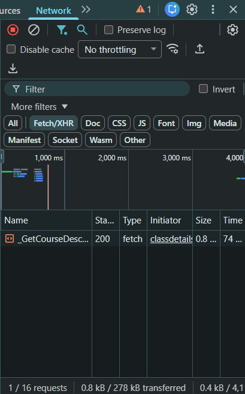

# course_suggestion

## api calls

use sis and hooslist api. example in `example_get.py`. sis api is very slow, hooslist is slightly better.

### sis api
sis api documentation: https://s23.cs3240.org/sis-api.html

get all course mnemonics:
```
https://sisuva.admin.virginia.edu/psc/ihprd/UVSS/SA/s/WEBLIB_HCX_CM.H_CLASS_SEARCH.FieldFormula.IScript_ClassSearchOptions?institution=UVA01&term={term}
```

* replace `{term}` with `1268` for spring 2026

get all courses given subject:
```
https://sisuva.admin.virginia.edu/psc/ihprd/UVSS/SA/s/WEBLIB_HCX_CM.H_CLASS_SEARCH.FieldFormula.IScript_ClassSearch?institution=UVA01&term={term}&subject={subject}&page={page}
```

* replace `{term}` as before
* replace `{subject}` with course mnemonic
* replace `{page}` with page number. if `0`, then `response['pageCount']` stores how many pages, otherwise it is `0`.

get information on class:
```
https://sisuva.admin.virginia.edu/psc/ihprd/UVSS/SA/s/WEBLIB_HCX_CM.H_CLASS_SEARCH.FieldFormula.IScript_ClassDetails?institution=UVA01&term={term}&class_nbr={number}
```

* replace `{term}` as before
* replace `{number}` with unique id number

### hooslist api
no documentation for this one, i found it through chrome dev tools and looking at all network calls when using hooslist webpage. (it will show up when clicking any specific section of any course in hooslist)


get course description:
```
https://hooslist.virginia.edu/ClassSchedule/_GetCourseDescription?subject={subject}&courseNum={number}
```

* replace `{subject}` with course mnemonic
* replace `{number}` with course number

### other (these require sis authentication, probably wont use these)

sis retrieve transcript (we can just have the user upload .pdf manually)
```
https://sisuva.admin.virginia.edu/psc/ihprd/UVSS/SA/s/WEBLIB_HCX_RE.H_VW_UNOFF_TRANSCR.FieldFormula.IScript_PrintTranscript?institution=UVA01&transcript_type=UNADV
```

retrieve schedule (we can just have the user upload .ics manually)
```
https://sisuva.admin.virginia.edu/psc/ihprd/UVSS/SA/s/WEBLIB_HCX_EN.H_SCHEDULE.FieldFormula.IScript_ScheduleByTerm?x_term=1262
```